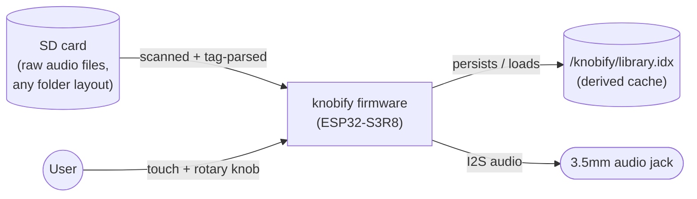
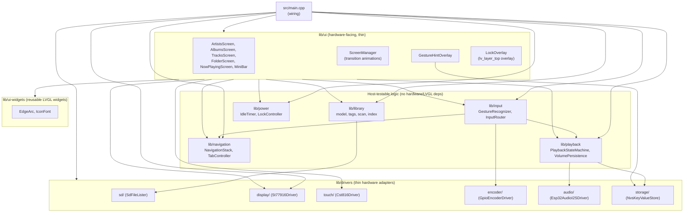
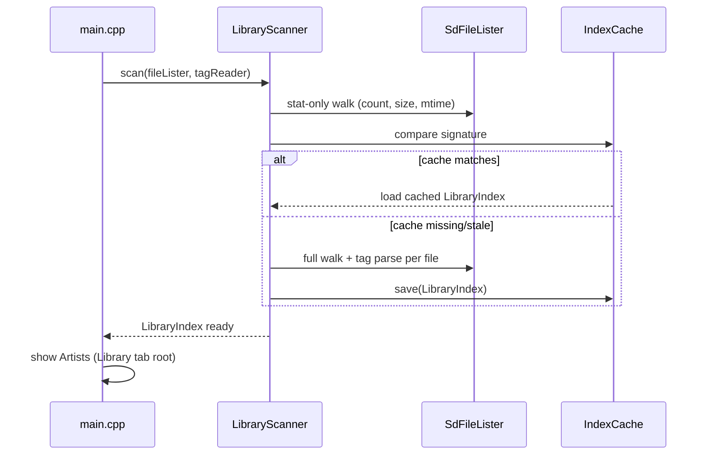
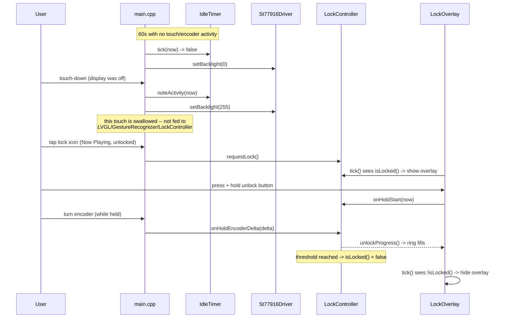

# knobify — Architecture Documentation (arc42)

Following the [arc42](https://arc42.org) template. Sections that don't
make sense to fill yet (because the thing they describe doesn't exist as
code) are stubbed with a note on when they'll be completed — they are not
skipped silently, so the document's own state is honest about what's
designed vs. undesigned.

Don't be shy about Mermaid diagrams (component, sequence, state) wherever
a picture would answer the reader's question faster than prose — Context
and Scope, Building Block View, and Runtime View are the sections most
likely to want one.

## 1. Introduction and Goals

`knobify` is offline music player firmware for a Waveshare
ESP32-S3-Knob-Touch-LCD-1.8 board. It plays music stored on an SD card
through the board's 3.5mm audio jack, controlled via the rotary encoder
and touch display.

**v1 goals** (see [ADR 0002](../adr/0002-v1-format-and-mcu-scope.md)):
play MP3/WAV/OGG files from an SD card, browse a library by artist/album
(not just raw folders), control via touch + one rotary encoder, fully
offline.

**Explicitly out of scope**: Bluetooth output, Wi-Fi-based features,
AAC/M4A native decoding, the secondary MCU.

## 2. Constraints

- **Hardware**: fixed to the Waveshare ESP32-S3-Knob-Touch-LCD-1.8 (see
  [`device.md`](../../device.md)) — ESP32-S3R8 (8MB PSRAM), 360×360 IPS
  touch LCD (ST77916/CST816), PCM5100A I2S DAC, one rotary encoder used in
  v1, microSD card socket.
- **Developer background**: solo developer, new to C/C++ and embedded
  development (see [ADR 0001](../adr/0001-language-and-framework-choice.md)).
- **Licensing**: project will be published open source from Germany; no
  AAC decoding to avoid licensing exposure (ADR 0002).
- **No CI dependency**: not pushed to GitHub in early iterations; local
  verification (`scripts/check.sh`) must work standalone
  (ADR 0003).

## 3. Context and Scope

The SD card holds only raw audio files (MP3/WAV/OGG) in whatever folder
layout the user already has — the firmware does not require or enforce a
particular folder structure. Everything the firmware derives from that —
the tag-based Artist/Album/Track index and its on-disk cache
(`/knobify/library.idx`) — is **derived state**, not authoritative: it can
always be rebuilt from the SD card's actual files, and a mismatch between
cache and card content is detected and repaired automatically on boot
(see [ADR 0004](../adr/0004-navigation-library-and-index-architecture.md)).



External context: no network, no cloud, no other devices — a single
offline system boundary around the primary MCU, its SD card, display/
touch, encoder, and audio output.

## 4. Solution Strategy

- PlatformIO + Arduino framework, targeting the primary ESP32-S3R8 MCU
  only for v1 (ADR 0001, ADR 0002).
- LVGL for UI, `ESP32-audioI2S` for decode/playback.
- Hardware/logic separation throughout, enabling host-native unit testing
  of everything except actual driver behavior (ADR 0003).

## 5. Building Block View

Designed this session (see [ADR 0004](../adr/0004-navigation-library-and-index-architecture.md));
implementation follows. Modules are organized by domain under `lib/`, per
[`coding-guidelines.md`](../coding-guidelines.md#project-layout).



- **`lib/navigation`** — `NavigationStack` (injectable-root screen
  stack) and `TabController` (owns the Library/Files tabs, decides
  pop-vs-tab-switch on a swipe).
- **`lib/library`** — `model` (plain Artist/Album/Track structs), `tags`
  (hand-rolled ID3v2/Vorbis-comment/RIFF-INFO parsers behind a
  `TagReader`/`RawFile` interface), `scan` (`FileLister` interface,
  `LibraryScanner`, `FolderBrowser` for live Files-mode listing),
  `index` (`IndexCache` — the `/knobify/library.idx` format and
  staleness-signature check).
- **`lib/playback`** — `PlaybackStateMachine` driving a `PlaybackDriver`
  interface (wraps `ESP32-audioI2S`), plus `VolumePersistence` over a
  `KeyValueStore` interface (wraps NVS).
- **`lib/input`** — `GestureRecognizer` (raw touch points → tap/swipe
  with direction) and `InputRouter` (context-sensitive encoder routing:
  list-scroll vs. volume, by current screen kind).
- **`lib/power`** (ADR 0005) — `IdleTimer` (display on/off, idle-timeout
  driven) and `LockController` (lock state + the hold-button-while-
  turning-encoder unlock gesture). Host-testable, no LVGL/hardware deps,
  same pattern as `lib/playback`/`lib/navigation`.
- **`lib/ui`** — LVGL screens, `ScreenManager` (dispatch + transition
  animation), `GestureHintOverlay` (one-time nudge), `LockOverlay` (ADR
  0005 — the locked-device UI, shown/hidden on LVGL's top layer,
  independent of `NavigationStack`). Hardware-facing but kept thin; not
  host-tested.
- **`lib/ui-widgets`** (ADR 0005) — `EdgeArc` (reusable round-edge ring,
  backs both the volume indicator and unlock progress) and `IconFont` (a
  small custom LVGL font for the lock/unlock glyphs LVGL's built-in
  symbol font doesn't have).
- **`lib/drivers`** — one thin adapter per peripheral, each the sole
  place its hardware API (Arduino `SD`, LVGL flush callbacks, `CST816`
  reads, GPIO quadrature reads, `ESP32-audioI2S`, `Preferences`/NVS) is
  called from.
- **`src/main.cpp`** — constructs concrete drivers and injects them into
  the logic layer; no logic of its own.

## 6. Runtime View

**Boot → library ready:**



**Browsing to playback:**

```mermaid
sequenceDiagram
    participant U as User (touch)
    participant UI as Screen (Artists/Albums/Tracks)
    participant Nav as NavigationStack
    participant PB as PlaybackStateMachine
    participant Drv as PlaybackDriver

    U->>UI: tap Artist
    UI->>Nav: push(Albums, artistId)
    U->>UI: tap Album
    UI->>Nav: push(Tracks, albumId)
    U->>UI: tap Track
    UI->>PB: Play(trackId, filePath)
    PB->>Drv: playFile(filePath)
    UI->>Nav: push(NowPlaying)
    Note over U,Drv: encoder now adjusts volume (NowPlaying);\nit scrolled lists on the prior screens
```

A left-right swipe pops one level (`NavigationStack::pop`) at any depth,
or switches the Library/Files tab when already at a tab root
(`TabController`) — see [ADR 0004](../adr/0004-navigation-library-and-index-architecture.md).

**Idle → display off → wake → locked → unlock** (ADR 0005):



## 7. Deployment View

Single target: the ESP32-S3R8 primary MCU on the Waveshare board, flashed
via USB-C (CH340 USB-serial). No server/cloud component — fully offline
per project goals.

## 8. Cross-cutting Concepts

- **Hardware/logic separation** — see
  [`coding-guidelines.md`](../coding-guidelines.md).
- **Testing strategy** — see [ADR 0003](../adr/0003-testing-strategy.md).
- **UI/UX concepts** — navigation model (injectable-root screen stack +
  Library/Files tabs), context-sensitive encoder behavior, swipe-based
  back/tab-switch navigation, one-time gesture-hint animation, and
  screen-transition animation. See
  [ADR 0004](../adr/0004-navigation-library-and-index-architecture.md)
- **Display power and device lock** — idle-timeout display off/wake
  (with first-touch-after-wake swallowed), and a manual lock using a
  hold-button-while-turning-encoder unlock gesture, independent states
  driven by `lib/power`. See
  [ADR 0005](../adr/0005-power-lock-and-round-edge-indicators.md)
- **Concurrency** — `src/main.cpp`'s `loop()` (LVGL, input, navigation)
  runs single-threaded on Arduino's default core (1); audio decode
  (`Esp32AudioI2SDriver`) runs on its own FreeRTOS task on the otherwise-
  idle core 0, mutex-guarded, so display/UI work never starves the
  audio codec's need to be serviced continuously. See
  [ADR 0006](../adr/0006-audio-task-concurrency.md)
  for the full rationale.

## 9. Architecture Decisions

See [`docs/adr/`](../adr/README.md) for the full ADR log.

## 10. Quality Requirements

*To be completed — no formal quality scenarios defined yet beyond the
implicit ones in the goals (offline, usable via knob+touch, open source
without licensing risk). Revisit once v1 scope is being implemented.*

## 11. Risks and Technical Debt

(Folds in aim42-style risk/tech-debt practices rather than maintaining a
separate framework — see [ADR discussion](../adr/0001-language-and-framework-choice.md).)

- **Dual-MCU communication is undesigned.** If dual-encoder support or any
  other secondary-MCU feature is wanted later, there's currently no
  researched protocol for how the two MCUs should talk to each other
  outside of Bluetooth use cases. Flagged in ADR 0002.
- **Library/decoder dependency risk.** `ESP32-audioI2S` and LVGL are
  third-party dependencies this project leans on heavily; no fallback
  plan if either becomes unmaintained. Acceptable for now given their
  current activity level, but worth monitoring.
- **No automated hardware regression testing.** On-device behavior
  (display, touch, I2S output) is only verified manually. See ADR 0003.

## 12. Glossary

| Term | Meaning |
|------|---------|
| MCU | Microcontroller unit. This board has two — see [`device.md`](../../device.md). |
| ADR | Architecture Decision Record — see [`docs/adr/`](../adr/README.md). |
| I2S | Inter-IC Sound — digital audio interface used to drive the PCM5100A DAC. |
